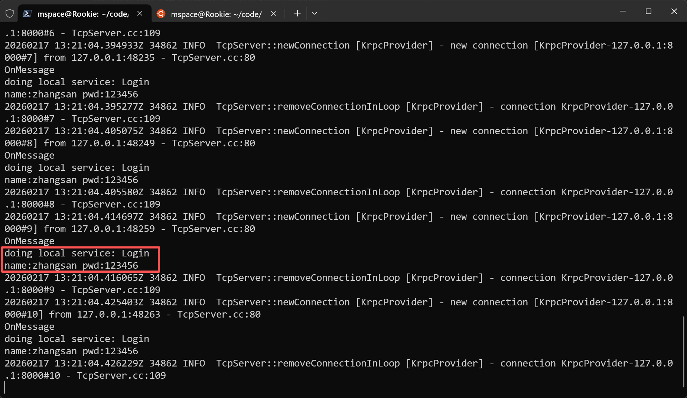
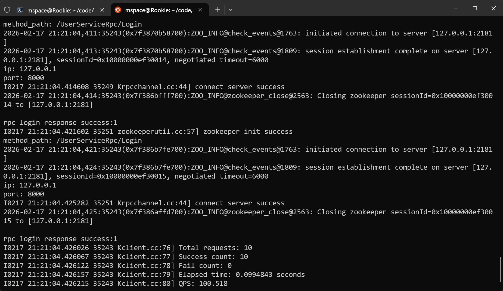
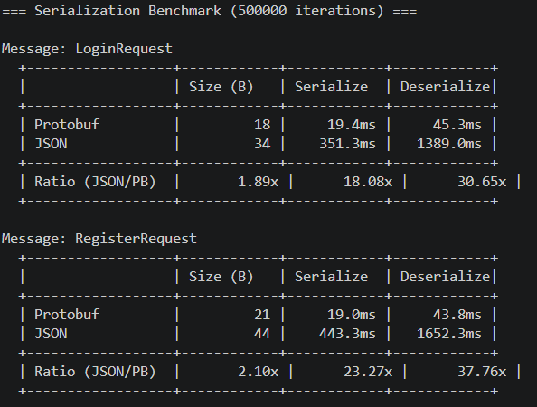
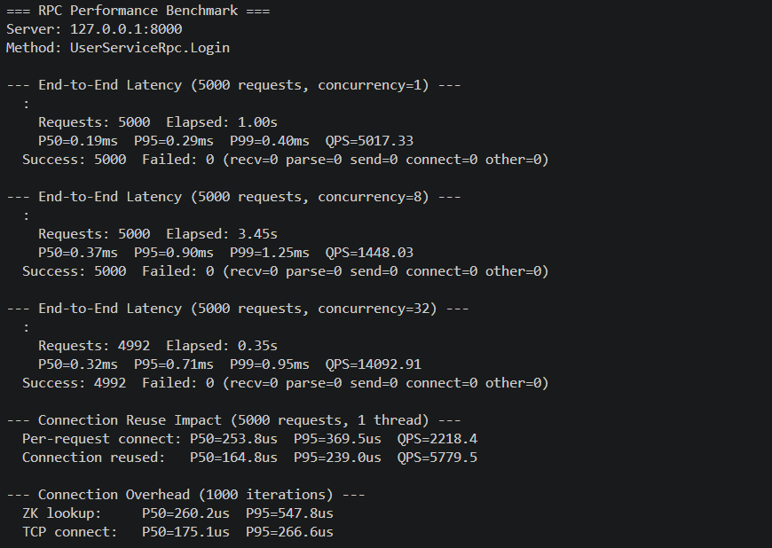

# Krpc

# 项目概述

本项目基于protobuf的c++分布式网络通信框架，使用了zookeeper作为服务中间件，负责解决在分布式服务部署中 服务的发布与调用、消息的序列与反序列化、网络包的收发等问题，使其能提供高并发的远程函数调用服务，可以让使用者专注于业务，快速实现微服务的分布式部署，项目会继续完善的欢迎，大家一起学习。

## 运行环境

Ubuntu 20.04 LTS

## 库准备
1. 安装基础工具
```shell
sudo apt-get install -y wget cmake build-essential unzip
```

2. Muduo 库的安装
Muduo 是一个基于多线程 Epoll 模式的高效网络库，负责数据流的网络通信。

- 安装教程参考：[Mudo安装](https://blog.csdn.net/QIANGWEIYUAN/article/details/89023980)

3. Zookeeper 的安装
Zookeeper 负责服务注册与发现，动态记录服务的 IP 地址及端口号，以便调用端快速找到目标服务。

* 安装 Zookeeper：
```shell
sudo apt install zookeeperd
```
* 安装 Zookeeper 开发库：
```shell
sudo apt install libzookeeper-mt-dev
```
4. Protobuf 的安装
Protobuf 负责 RPC 方法的注册、数据的序列化与反序列化。
相较于 XML 和 JSON，Protobuf 是二进制存储，效率更高。
本地版本：3.12.4
在 Ubuntu 22 上可以直接安装：
```shell
sudo apt-get install protobuf-compiler libprotobuf-dev
```

5. 安装boost库
```shell
sudo apt-get install -y libboost-all-dev
```

6. Glog 日志库的安装
Glog 是一个高效的异步日志库，用于记录框架运行时的调试与错误日志。
```shell
sudo apt-get install libgoogle-glog-dev libgflags-dev
```

## 编译指令

第一步：进入到Krpc文件
```shell
cd Krpc
```

第二步：生成项目可执行程序
```shell
mkdir -p build && cd build && cmake .. && make -j$(nproc) 
```

第三步：如果修改了 proto 文件，需要重新生成 C++ 代码：
```shell
# 生成 user.pb.h 和 user.pb.cc
protoc --cpp_out=example example/user.proto
# 生成 Krpcheader.pb.h 和 Krpcheader.pb.cc
protoc --cpp_out=src src/Krpcheader.proto
```
然后重新执行第二步。

第四步：运行 server 和 client
```shell
# 启动服务端
cd bin && ./server -i ./test.conf

# 启动客户端（另一个终端）
cd bin && ./client -i ./test.conf
```

### 编译性能测试工具（可选）

```shell
cd build && cmake .. -DKRPC_BUILD_BENCHMARKS=ON && make -j$(nproc)

# 序列化对比测试（无需启动服务器）
./bin/ser_bench

# RPC 端到端性能测试（需要 server + ZK 运行）
./bin/rpc_bench -i ./bin/test.conf
./bin/rpc_bench -i ./bin/test.conf --concurrency 1,8,32 --requests 5000
```

详细的性能测试方案和结果请参考 [BENCHMARK.md](./BENCHMARK.md)。


## 整体的框架

- **muduo库**：负责数据流的网络通信，采用了多线程epoll模式的IO多路复用，让服务发布端接受服务调用端的连接请求，并由绑定的回调函数处理调用端的函数调用请求。

- **Protobuf**：负责RPC方法的注册，数据的序列化和反序列化，相比于文本存储的XML和JSON来说，Protobuf是二进制存储，且不需要存储额外的信息，效率更高。

- **Zookeeper**：负责分布式环境的服务注册，记录服务所在的IP地址以及端口号，可动态地为调用端提供目标服务所在发布端的IP地址与端口号，方便服务所在IP地址变动的及时更新。

- **TCP沾包问题处理**：定义服务发布端和调用端之间的消息传输格式（`RpcHeader` + varint32 长度前缀），记录方法名和参数长度，防止沾包。

- **Glog日志库**：后续增加了Glog的日志库，进行异步的日志记录。框架内所有调试/错误信息均通过 `LOG()` 宏输出，可通过 `FLAGS_minloglevel` 统一控制日志级别。

- **连接复用**：`KrpcChannel` 支持 `set_reuse_connection(true)` 启用连接复用，避免每次 RPC 调用都执行 TCP 三次握手，生产环境建议启用以获得 2.4x QPS 提升。

- **性能基准测试**：提供序列化对比（Protobuf vs JSON）和端到端 RPC 性能测试（延迟百分位 P50/P95/P99、QPS、连接开销分析）工具。详见 [BENCHMARK.md](./BENCHMARK.md)。


## 运行结果

通过运行 `bin` 目录下的 `server` 和 `client`，可以观察到以下结果。以下是运行日志中的关键步骤和解析：

---

### 服务端运行结果



- **运行结果说明**：该图展示了服务器成功启动并监听客户端请求的状态。

**服务器日志解析**：
- `doing local service: Login`  
  - 表示客户端发起对服务 `Login` 的调用。
- `name: zhangsan pwd: 123456`  
  - 客户端向服务端发送了用户名 `zhangsan` 和密码 `123456`。
- `new connection`  
  - 客户端成功与服务端建立了一条新连接。

---

### 客户端运行结果



- **运行结果说明**：该图展示了客户端成功连接到服务器并发送请求的状态。

**客户端日志解析**：

- `rpc login response success:1`  
  - 表示客户端的登录请求成功，服务器返回响应值 `1`。
- `session establishment complete on server`  
  - 表示与 Zookeeper 的会话成功建立，服务端已注册在 Zookeeper 中。
- `connect server success`  
  - 表示服务端成功连接到目标地址。
---

该结果表明客户端与服务端成功完成了一次 RPC 通信，包括服务调用、请求处理和结果返回，验证了框架的稳定性和功能性。

## 基准测试
### 序列化对比测试（ser_bench）

**目的**：验证 Protobuf 相比 JSON 在体积和速度上的优势，用数据支撑 README 中的声明。

**测试方法**：
- 使用 `LoginRequest`（name="zhangsan", pwd="123456"）和 `RegisterRequest`（id=1001, name="zhangsan", pwd="123456"）作为测试样本
- 对每种消息类型，分别用 Protobuf 和 JSON (jsoncpp) 执行 500,000 次序列化/反序列化
- 记录总耗时、序列化后字节大小
- Protobuf 和 JSON 分别连续执行（先跑完所有 Protobuf，再跑 JSON），避免 CPU 缓存交叉影响

**运行方式**（无需启动服务器）：
```bash
./bin/ser_bench
```



### RPC 端到端测试（rpc_bench）

**目的**：测量 Krpc 框架在真实网络环境下的性能表现。

- 在多个并发级别（1, 2, 4, 8, 16, 32 线程）下各发送 N 个请求
- 每个请求经历完整链路：ZK 服务发现 → TCP 连接 → 序列化发送 → 服务端处理 → 接收响应 → 反序列化
- 记录每个请求的延迟，计算 P50/P95/P99/QPS
- 观察随着并发增加，吞吐是否线性增长、延迟是否可控

**运行方式**：
```bash
# 需要先启动服务端: ./bin/server -i ./bin/test.conf
./bin/rpc_bench -i ./bin/test.conf --concurrency 1,8,32 --requests 5000
```



## 总结
- Krpc是一个基于protobuf的C++分布式网络通信框架，旨在简化微服务的部署与调用。
- 通过结合Muduo库、Zookeeper和Glog，Krpc提供了高效的网络通信、服务注册与发现以及日志记录功能。
- 该框架支持高并发的远程函数调用，允许开发者专注于业务逻辑的实现。
- 项目的设计考虑了性能和易用性，适合在现代分布式系统中使用。
- 未来将继续完善，欢迎更多开发者参与学习与贡献。

